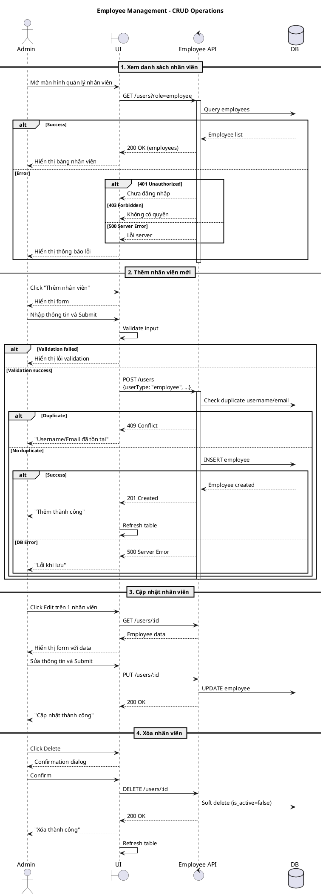

# 📋 DANH SÁCH CÔNG VIỆC CẦN LÀM - DỰ ÁN QUẢN LÝ PHÒNG KHÁM MẮT
**Thời hạn: 1 tuần (7 ngày)**  
**Ngày bắt đầu: 24/10/2025**  
**Mục tiêu: Hoàn thiện dự án sẵn sàng deploy và demo**

---

## 🎯 TỔNG QUAN DỰ ÁN

### Kiến trúc hiện tại:
- **Frontend**: JavaFX (oop_ui) - Desktop Application
- **Backend**: Mini-boot HTTP Server (REST API)
- **Database**: PostgreSQL (Supabase)
- **Các module chính**:
  - ✅ Authentication (Login, Signup, Forgot Password)
  - ✅ Appointment Management (Đặt lịch, quản lý lịch hẹn)
  - ✅ Patient & Prescription (Quản lý bệnh nhân, đơn thuốc)
  - ✅ Inventory Management (Quản lý kho, sản phẩm, xuất nhập kho)
  - ✅ Payment & Invoice (Thanh toán, hóa đơn)
  - ⚠️ Schedule (Lịch làm việc bác sĩ - đang thiếu tích hợp)
  - ❌ Employee Management (THIẾU HOÀN TOÀN)

---

## 🔴 NHÓM 1: GIAO DIỆN & CSS (QUAN TRỌNG - ƯU TIÊN CAO)
**Thời gian: 2 ngày (Ngày 1-2)**

### 1.1. Tạo CSS cho toàn bộ ứng dụng
**Hiện trạng**: Hiện tại KHÔNG có file CSS nào, tất cả styling đều inline trong FXML
**Cần làm**:

#### ✅ Tạo file CSS chính
- [ ] `src/main/resources/css/main.css` - Theme chính của app
- [ ] `src/main/resources/css/login.css` - Style cho màn hình login/signup
- [ ] `src/main/resources/css/dashboard.css` - Style cho dashboard
- [ ] `src/main/resources/css/forms.css` - Style cho các form nhập liệu
- [ ] `src/main/resources/css/tables.css` - Style cho TableView
- [ ] `src/main/resources/css/buttons.css` - Style cho các nút bấm

#### ✅ Thiết kế hệ thống màu sắc
```css
/* Color Palette */
--primary-color: #2196F3;      /* Xanh dương chính */
--secondary-color: #4CAF50;    /* Xanh lá */
--danger-color: #F44336;       /* Đỏ */
--warning-color: #FF9800;      /* Cam */
--success-color: #4CAF50;      /* Xanh lá thành công */
--text-primary: #212121;       /* Text màu đen */
--text-secondary: #666666;     /* Text màu xám */
--background-light: #f5f5f5;   /* Nền sáng */
--border-color: #ddd;          /* Viền */
```

#### ✅ Apply CSS vào FXML
- [ ] Update tất cả file FXML để load CSS: `stylesheets="@../css/main.css"`
- [ ] Loại bỏ inline style, thay bằng styleClass
- [ ] Thêm hover effects cho buttons
- [ ] Thêm focus effects cho TextFields
- [ ] Responsive table headers

**File cần update**:
- Login.fxml, Signup.fxml, ChangePassword.fxml, ResetPassword.fxml
- Tất cả FXML trong thư mục Schedule/, Payment/, Inventory/, PatientAndPrescription/

---

## 🔴 NHÓM 2: NAVIGATION & SCENE MANAGEMENT (QUAN TRỌNG)
**Thời gian: 1.5 ngày (Ngày 2-3)**

### 2.1. Tạo Dashboard/Main Menu chính
**Hiện trạng**: Sau khi login, app load `/FXML/hello-view.fxml` (file test) - KHÔNG CÓ DASHBOARD THỰC SỰ

#### ✅ Tạo Dashboard chính
- [ ] Tạo file `Dashboard.fxml` - Màn hình chính sau login
- [ ] Tạo `DashboardController.java`
- [ ] Design layout:
  - Top bar: Logo, tên user, nút logout
  - Left sidebar: Menu điều hướng với icon
  - Center: Content area để load các scene con
  - Bottom: Status bar

#### ✅ Menu items cần có:
```
📊 Dashboard (Tổng quan)
👥 Quản lý bệnh nhân
📅 Lịch hẹn
   - Đặt lịch mới
   - Quản lý lịch hẹn
   - Lịch làm việc bác sĩ
📦 Kho & Sản phẩm
   - Quản lý sản phẩm
   - Xuất nhập kho
   - Tìm kiếm sản phẩm
💰 Thanh toán
   - Tạo hóa đơn
   - Thanh toán
   - Lịch sử thanh toán
   - Báo cáo tài chính
👨‍⚕️ Quản lý nhân sự (MỚI)
👤 Tài khoản
   - Thông tin cá nhân
   - Đổi mật khẩu
   - Đăng xuất
```

### 2.2. Kết nối các scene với nhau
**Hiện trạng**: Các scene độc lập, không có navigation nhất quán

#### ✅ Tạo SceneManager utility class
```java
public class SceneManager {
    private static Stage primaryStage;
    private static Scene currentScene;
    private static Map<String, Parent> cachedScenes;
    
    // Navigation methods
    public static void switchScene(String fxmlPath);
    public static void openInNewWindow(String fxmlPath);
    public static void goBack();
    public static void showDialog(String fxmlPath);
}
```

#### ✅ Update tất cả Controllers
- [ ] Thay thế code navigation thủ công bằng `SceneManager.switchScene()`
- [ ] Thống nhất cách chuyển scene
- [ ] Thêm breadcrumb/navigation history

**Files cần update**:
- LoginController.java (line 155: load dashboard thay vì hello-view)
- SignUpController.java (line 337)
- ForgotPasswordController.java (line 227)
- Tất cả Controllers khác có FXMLLoader

### 2.3. Tạo màn hình tổng quan (Home/Overview)
- [ ] Tạo `HomeView.fxml` và `HomeViewController.java`
- [ ] Hiển thị thống kê tổng quan:
  - Số lịch hẹn hôm nay
  - Số bệnh nhân mới
  - Doanh thu trong ngày
  - Tồn kho sắp hết
- [ ] Recent activities (hoạt động gần đây)

---

## 🔴 NHÓM 3: XỬ LÝ LỖI HTTP (CRITICAL)
**Thời gian: 1 ngày (Ngày 3-4)**

### 3.1. Hiện trạng xử lý lỗi
**Vấn đề phát hiện**:
- ✅ Code đã kiểm tra `statusCode` (200, 201, 400, 404, 401, 403, 422, 429, 500, 503, 504)
- ❌ Nhưng KHÔNG hiển thị thông báo lỗi cụ thể cho user
- ❌ Chỉ in ra console `System.err.println()`
- ❌ Không có xử lý retry khi 503/504
- ❌ Không có loading indicator khi gọi API

### 3.2. Tạo Error Handling Framework
#### ✅ Tạo ErrorHandler utility
```java
public class ErrorHandler {
    public static void handleHttpError(int statusCode, String message);
    public static void showUserFriendlyError(int statusCode, String context);
    public static String getErrorMessage(int statusCode);
    public static boolean shouldRetry(int statusCode);
}
```

#### ✅ Error messages mapping
```java
400 -> "Dữ liệu không hợp lệ. Vui lòng kiểm tra lại thông tin."
401 -> "Phiên đăng nhập hết hạn. Vui lòng đăng nhập lại."
403 -> "Bạn không có quyền thực hiện thao tác này."
404 -> "Không tìm thấy dữ liệu."
409 -> "Dữ liệu đã tồn tại hoặc xung đột."
422 -> "Dữ liệu không đáp ứng quy tắc nghiệp vụ."
429 -> "Quá nhiều yêu cầu. Vui lòng thử lại sau."
500 -> "Lỗi server. Vui lòng liên hệ quản trị viên."
503 -> "Server đang bảo trì. Vui lòng thử lại sau."
504 -> "Kết nối timeout. Vui lòng kiểm tra mạng."
```

### 3.3. Update tất cả Service classes
**Files cần update** (tất cả đều cần xử lý lỗi tốt hơn):

#### Danh sách Services cần cải thiện:
- [ ] `HttpAppointmentService.java` - 386 dòng
- [ ] `HttpPaymentService.java` - 150 dòng  
- [ ] `HttpPaymentItemService.java`
- [ ] `HttpPaymentStatusLogService.java`
- [ ] `HttpDoctorService.java`
- [ ] `ApiProductService.java`
- [ ] `ApiStockMovementService.java`
- [ ] `CustomerRecordService.java`
- [ ] `PrescriptionService.java`

**Cần làm cho MỖI service**:
```java
// Thay vì:
if (response.statusCode() == 200) {
    return data;
} else {
    System.err.println("❌ HTTP Error: " + response.statusCode());
    return null;
}

// Làm thành:
if (response.statusCode() == 200) {
    return data;
} else {
    String errorMsg = ErrorHandler.getErrorMessage(response.statusCode());
    Platform.runLater(() -> {
        ErrorHandler.showUserFriendlyError(response.statusCode(), 
            "Lỗi khi tải dữ liệu");
    });
    throw new HttpException(response.statusCode(), errorMsg);
}
```

### 3.4. Thêm Loading Indicators
- [ ] Tạo `LoadingOverlay.fxml` - Overlay khi loading
- [ ] Thêm ProgressIndicator trong BaseController
- [ ] Show/hide khi gọi API

---

## 🔴 NHÓM 4: MODULE QUẢN LÝ NHÂN SỰ (THIẾU HOÀN TOÀN)
**Thời gian: 1.5 ngày (Ngày 4-5)**

### 4.1. Database đã có
**Bảng Employees đã có trong DB**:
```sql
Table Employees {
  id, username, password, firstname, lastname, 
  avatar, role (doctor/nurse), license_no, 
  email, phone, is_active, created_at
}
```

### 4.2. Backend API cần bổ sung
**Hiện trạng**: Có `UserController.java` trong mini-boot nhưng CHƯA mount vào router

#### ✅ Cần làm trong mini-boot:
- [ ] Mount `UserController` trong `ServerMain.java`:
  ```java
  UserController.mount(router);
  ```
- [ ] Test các endpoints:
  - GET /users - Lấy danh sách nhân viên
  - GET /users/:id - Chi tiết nhân viên
  - POST /users - Tạo nhân viên mới
  - PUT /users/:id - Cập nhật nhân viên
  - DELETE /users/:id - Xóa nhân viên

### 4.3. Frontend JavaFX cần tạo mới

#### ✅ Tạo FXML Views
- [ ] `EmployeeManagement.fxml` - Màn hình quản lý nhân viên
  - TableView danh sách nhân viên
  - Nút Add, Edit, Delete, Search
  - Filter theo role (Doctor/Nurse)
  - Filter theo trạng thái (Active/Inactive)

- [ ] `EmployeeForm.fxml` - Form thêm/sửa nhân viên
  - TextField: username, firstname, lastname, email, phone, license_no
  - PasswordField: password (chỉ khi tạo mới)
  - ComboBox: role (Doctor/Nurse)
  - CheckBox: is_active
  - ImageView: avatar upload
  - Buttons: Save, Cancel

#### ✅ Tạo Controllers
- [ ] `EmployeeManagementController.java`
  - extends BaseController
  - Load danh sách từ API
  - Search/Filter
  - Mở form thêm/sửa
  - Xóa với confirmation dialog

- [ ] `EmployeeFormController.java`
  - Validation input
  - Upload avatar (optional)
  - Save qua API
  - Xử lý lỗi

#### ✅ Tạo Service
- [ ] `HttpEmployeeService.java` hoặc `ApiEmployeeService.java`
  ```java
  public class HttpEmployeeService {
      private final String baseUrl = "http://localhost:8080";
      
      public List<Employee> getAllEmployees();
      public Employee getEmployeeById(int id);
      public Employee createEmployee(Employee employee);
      public Employee updateEmployee(Employee employee);
      public boolean deleteEmployee(int id);
      public List<Employee> searchEmployees(String keyword);
      public List<Employee> getEmployeesByRole(String role);
  }
  ```

#### ✅ Update Navigation
- [ ] Thêm menu item "Quản lý nhân sự" vào Dashboard
- [ ] Phân quyền: Chỉ ADMIN mới thấy menu này

### 4.4. Tạo Sequence Diagram (PlantUML)
- [ ] Tạo file `UML/Sequence/Employee/EmployeeManagement.puml`


---

## 🟡 NHÓM 5: HOÀN THIỆN TÍNH NĂNG HIỆN CÓ
**Thời gian: 1 ngày (Ngày 5-6)**

### 5.1. Sửa các TODO trong code
**Danh sách TODO cần xử lý**:

#### Payment Module:
- [ ] `PaymentHistoryController.java` line 76: Lấy tên khách hàng từ CustomerRepository
- [ ] `PaymentHistoryController.java` line 85: Lấy tên nhân viên từ StaffRepository
- [ ] `PaymentHistoryController.java` line 219: Thêm chức năng xem chi tiết
- [ ] `PaymentController.java` line 197: Implement hàm `service.update(currentPayment)`
- [ ] `ReceiptController.java` line 104: Get cashier name instead of ID

#### Schedule Module:
- [ ] `DoctorScheduleController.java` line 166: Lấy role từ session user
- [ ] `DoctorScheduleController.java` line 869: Gọi API backend để lưu working hours
- [ ] `DoctorScheduleController.java` line 987: Export PDF thực sự với iText library
- [ ] `DoctorScheduleController.java` line 1036: Implement undo logic
- [ ] `DoctorScheduleController.java` line 1044: Implement redo logic
- [ ] `AppointmentManagementController.java` line 492: Implement send SMS
- [ ] `AppointmentManagementController.java` line 518: Get email from customer
- [ ] `AppointmentManagementController.java` line 576: Actual Email API call

#### Inventory Module:
- [ ] `ProductCRUDController.java` line 432: Implement export functionality
- [ ] `ProductCRUDController.java` line 438: Implement import functionality  
- [ ] `StockMovementController.java` line 561: Implement export to Excel/CSV

#### Appointment Module:
- [ ] `ScheduleValidator.java` line 68: Check giờ làm việc của bác sĩ
- [ ] `ScheduleValidator.java` line 69: Check bệnh nhân có trùng lịch không
- [ ] `AppointmentController.java` line 133: Validate slot nếu thay đổi thời gian

### 5.2. Loại bỏ Debug code
**Files có nhiều debug code cần dọn dẹp**:
- [ ] `HttpAppointmentService.java` - Xóa các dòng `System.out.println("🔍 DEBUG: ...")`
- [ ] `ApiProductService.java` - Xóa debug comments
- [ ] `ApiStockMovementService.java` - Xóa debug prints
- [ ] `ProductCRUDController.java` - Xóa debug statements
- [ ] `InvoiceController.java` line 424: Xóa `System.out.println("debug");`

### 5.3. Hoàn thiện CustomerRecord integration
- [ ] Kiểm tra `Spectacle_Prescriptions` table có `customer_id` mới thêm
- [ ] Update `PrescriptionEditor` để hiển thị customer info
- [ ] Link từ Customer Hub sang Prescription của customer đó

### 5.4. Báo cáo tài chính
- [ ] Hoàn thiện `FinancialReportController.java` (hiện đang rỗng)
- [ ] Implement charts: revenue by day/month, top products, etc.
- [ ] Export báo cáo PDF

---

## 🟡 NHÓM 6: DEPLOYMENT & SERVER CONFIGURATION
**Thời gian: 1 ngày (Ngày 6-7)**

### 6.1. Chuẩn bị Deploy Backend (mini-boot)

#### ✅ Application Properties
- [ ] Tạo `application.properties` từ template
- [ ] Cấu hình production database URL
- [ ] Set up environment variables cho sensitive data

#### ✅ Docker Configuration
- [ ] Tạo `Dockerfile` cho mini-boot:
```dockerfile
FROM openjdk:17-jdk-slim
WORKDIR /app
COPY target/mini-boot-1.0.0.jar app.jar
EXPOSE 8080
ENTRYPOINT ["java", "-jar", "app.jar"]
```

- [ ] Tạo `docker-compose.yml`:
```yaml
version: '3.8'
services:
  mini-boot:
    build: ./mini-boot
    ports:
      - "8080:8080"
    environment:
      - DB_URL=${DB_URL}
      - DB_USER=${DB_USER}
      - DB_PASSWORD=${DB_PASSWORD}
    restart: unless-stopped
```

#### ✅ Deploy options
**Option 1: VPS/Cloud Server (Recommended)**
- [ ] Deploy lên Railway/Render/Heroku (miễn phí)
- [ ] Configure CORS cho phép frontend connect
- [ ] Set up SSL certificate (Let's Encrypt)

**Option 2: Ngrok (Quick demo)**
- [ ] Install ngrok
- [ ] Run: `ngrok http 8080`
- [ ] Update frontend API URL

### 6.2. Package JavaFX Desktop App

#### ✅ Using jpackage (Java 17+)
- [ ] Configure pom.xml với jpackage plugin
- [ ] Build executable:
  ```bash
  mvn clean package
  jpackage --input target --name "Eye Clinic" \
           --main-jar oop_ui-1.0-SNAPSHOT.jar \
           --main-class org.example.oop.Main \
           --type exe --win-console
  ```

#### ✅ Alternative: Launch4j
- [ ] Tạo `.exe` file cho Windows
- [ ] Bundle JRE với app (để chạy trên máy không có Java)

### 6.3. Database Migration Script
- [ ] Tạo `init.sql` để init DB từ đầu
- [ ] Tạo `seed.sql` với sample data
- [ ] Document cách setup DB

### 6.4. Update ApiConfig
- [ ] `ApiConfig.java` line 11: Update PROD_BASE_URL
- [ ] Thêm option chọn server (Local/Production) trong UI
- [ ] Save preference vào config file

---

## 🟢 NHÓM 7: TESTING & DOCUMENTATION
**Thời gian: 0.5 ngày (Ngày 7)**

### 7.1. Testing
- [ ] Test tất cả API endpoints bằng Postman
- [ ] Test UI flows: Login → Dashboard → Each module
- [ ] Test error scenarios: Network error, 404, 401, etc.
- [ ] Cross-check với PlantUML diagrams

### 7.2. Documentation
- [ ] Update README.md với:
  - Yêu cầu hệ thống
  - Hướng dẫn cài đặt
  - Hướng dẫn chạy backend
  - Hướng dẫn chạy frontend
  - API documentation
  - Screenshots

- [ ] Tạo USER_GUIDE.md
  - Hướng dẫn sử dụng cho từng role (Admin, Doctor, Nurse, Customer)

- [ ] Tạo DEPLOYMENT.md
  - Hướng dẫn deploy production

---

## 📊 TIMELINE CHI TIẾT

### 🗓️ Ngày 1 (24/10/2025) - CSS Foundation
- Sáng: Tạo color palette và main.css (4h)
- Chiều: Áp dụng CSS cho Login/Signup/Dashboard (4h)

### 🗓️ Ngày 2 (25/10/2025) - CSS + Navigation
- Sáng: Hoàn thiện CSS cho các module còn lại (4h)
- Chiều: Tạo Dashboard chính và SceneManager (4h)

### 🗓️ Ngày 3 (26/10/2025) - Navigation + Error Handling
- Sáng: Hoàn thiện Navigation, kết nối scenes (4h)
- Chiều: Tạo Error Handling Framework (4h)

### 🗓️ Ngày 4 (27/10/2025) - Error Handling + Employee Module
- Sáng: Update tất cả Services với error handling (4h)
- Chiều: Bắt đầu Employee Module - Backend API (4h)

### 🗓️ Ngày 5 (28/10/2025) - Employee Module
- Sáng: Employee Module - Frontend Views (4h)
- Chiều: Employee Module - Controllers + Service + Sequence Diagram (4h)

### 🗓️ Ngày 6 (29/10/2025) - Polish + Deployment
- Sáng: Sửa TODOs, loại bỏ debug code (4h)
- Chiều: Setup deployment (Docker, ngrok) (4h)

### 🗓️ Ngày 7 (30/10/2025) - Testing + Documentation
- Sáng: Testing toàn diện (4h)
- Chiều: Hoàn thiện documentation (4h)

---

## 🎯 PRIORITIZATION

### 🔴 Must Have (Bắt buộc phải có)
1. CSS styling (2 ngày)
2. Dashboard & Navigation (1.5 ngày)
3. HTTP Error Handling (1 ngày)
4. Employee Management Module (1.5 ngày)

### 🟡 Should Have (Nên có)
5. Fix TODOs trong code (0.5 ngày)
6. Clean up debug code (0.5 ngày)
7. Deployment setup (1 ngày)

### 🟢 Nice to Have (Tốt nếu có)
8. Loading indicators
9. Advanced error retry
10. Offline mode

---

## 📁 CẤU TRÚC THƯ MỤC SAU KHI HOÀN THÀNH

```
OOP/
├── oop_ui/
│   ├── src/main/
│   │   ├── java/org/example/oop/
│   │   │   ├── Control/
│   │   │   │   ├── BaseController.java ✅
│   │   │   │   ├── DashboardController.java ⭐ MỚI
│   │   │   │   ├── HomeViewController.java ⭐ MỚI
│   │   │   │   ├── Employee/
│   │   │   │   │   ├── EmployeeManagementController.java ⭐ MỚI
│   │   │   │   │   └── EmployeeFormController.java ⭐ MỚI
│   │   │   │   ├── Schedule/...
│   │   │   │   ├── Payment/...
│   │   │   │   └── ...
│   │   │   ├── Service/
│   │   │   │   ├── HttpEmployeeService.java ⭐ MỚI
│   │   │   │   └── ...
│   │   │   ├── Utils/
│   │   │   │   ├── SceneManager.java ⭐ MỚI
│   │   │   │   ├── ErrorHandler.java ⭐ MỚI
│   │   │   │   ├── LoadingOverlay.java ⭐ MỚI
│   │   │   │   └── ...
│   │   │   └── Model/...
│   │   └── resources/
│   │       ├── css/ ⭐ MỚI
│   │       │   ├── main.css
│   │       │   ├── login.css
│   │       │   ├── dashboard.css
│   │       │   ├── forms.css
│   │       │   ├── tables.css
│   │       │   └── buttons.css
│   │       ├── FXML/
│   │       │   ├── Dashboard.fxml ⭐ MỚI
│   │       │   ├── HomeView.fxml ⭐ MỚI
│   │       │   ├── Employee/ ⭐ MỚI
│   │       │   │   ├── EmployeeManagement.fxml
│   │       │   │   └── EmployeeForm.fxml
│   │       │   └── ...
│   │       └── Image/...
│   └── pom.xml
├── mini-boot/
│   ├── src/main/java/org/miniboot/app/
│   │   ├── ServerMain.java (cần mount UserController)
│   │   ├── controllers/
│   │   │   ├── UserController.java ✅ (cần mount)
│   │   │   └── ...
│   │   └── ...
│   ├── Dockerfile ⭐ MỚI
│   ├── application.properties ⭐ TẠO TỪ TEMPLATE
│   └── pom.xml
├── UML/
│   ├── Sequence/
│   │   ├── Employee/ ⭐ MỚI
│   │   │   └── EmployeeManagement.puml
│   │   └── ...
│   └── ...
├── docker-compose.yml ⭐ MỚI
├── README.md ⚠️ CẦN CẬP NHẬT
├── USER_GUIDE.md ⭐ MỚI
├── DEPLOYMENT.md ⭐ MỚI
└── TODO_1_WEEK.md ⭐ FILE NÀY
```

---

## ✅ CHECKLIST TRƯỚC KHI DEMO

### Backend (mini-boot)
- [ ] Server chạy được trên http://localhost:8080
- [ ] Tất cả API endpoints hoạt động (test bằng Postman)
- [ ] Database connection stable
- [ ] CORS configured đúng
- [ ] UserController đã được mount

### Frontend (oop_ui)
- [ ] CSS được áp dụng toàn bộ, giao diện đẹp
- [ ] Dashboard chính hoạt động
- [ ] Navigation giữa các màn hình mượt mà
- [ ] Tất cả buttons/links đều hoạt động
- [ ] Error messages hiển thị user-friendly
- [ ] Loading indicators hoạt động
- [ ] Employee Management module hoàn chỉnh

### Integration
- [ ] Login → Dashboard flow hoạt động
- [ ] Tất cả CRUD operations test thành công
- [ ] Error scenarios được handle đúng
- [ ] Không còn console errors
- [ ] Không còn TODO/Debug code

### Documentation
- [ ] README.md đầy đủ
- [ ] API documentation
- [ ] User guide
- [ ] Deployment guide
- [ ] Screenshots/Video demo

---

## 🚀 GỢI Ý TỐI ƯU

### Nếu thiếu thời gian:
**Priority 1 (3 ngày)**: CSS + Dashboard + Error Handling
**Priority 2 (2 ngày)**: Employee Module cơ bản
**Priority 3 (1 ngày)**: Testing + Documentation
**Skip if needed**: Advanced features (PDF export, SMS, Excel export)

### Chia nhóm làm việc:
- **1 người**: CSS + UI/UX (2 ngày)
- **1 người**: Navigation + Scene Management (1.5 ngày)  
- **1 người**: Error Handling (1 ngày)
- **1-2 người**: Employee Module (1.5 ngày)
- **Cả nhóm**: Testing + Deployment (1 ngày)

### Tools hỗ trợ:
- **Postman**: Test API
- **Scene Builder**: Design FXML nhanh hơn
- **Figma/Canva**: Design mockup trước khi code
- **Git**: Commit thường xuyên, branch cho mỗi feature
- **Trello/Notion**: Track progress

---

## 📞 HỖ TRỢ & TÀI LIỆU THAM KHẢO

### JavaFX CSS
- https://openjfx.io/javadoc/17/javafx.graphics/javafx/scene/doc-files/cssref.html
- https://www.tutorialspoint.com/javafx/javafx_css.htm

### HTTP Error Handling
- https://developer.mozilla.org/en-US/docs/Web/HTTP/Status

### PlantUML
- https://plantuml.com/sequence-diagram

### Deployment
- Railway: https://railway.app
- Render: https://render.com  
- Ngrok: https://ngrok.com

---

**🎉 CHÚC TEAM HOÀN THÀNH TỐT DỰ ÁN TRONG 1 TUẦN! 🎉**

*Last updated: 24/10/2025*
